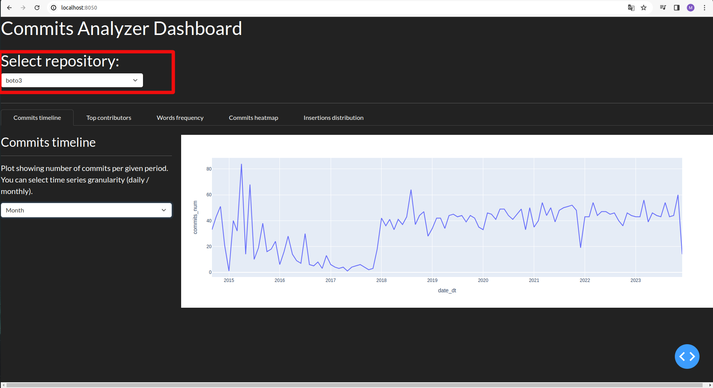

# commits-analyzer
*commits-analyzer* is a tool which allows you to conduct an automated analysis of commits
in selected *git* repositories. It includes full pipeline, starting from setting up a Postgres
database, through cloning chosen repositories, retrieving raw data using shell *git* command,
preprocessing and uploading data to the database, generating markdown and .pdf reports to deploying
dashboard on localhost, developed using *Dash*.

## Usage

### Requirements
In order to use this tool locally the following prerequisites must be met:
- You need to have *Python* interpreter installed on your computer (version  >= 3.10 is recommended)
- You need to set up *docker* and *docker compose*

And that's all! All we need to do is run a few commands, described in the next subsection.

WARNING - it is highly recommended to change default postgres password before starting the
whole process. It needs to be replaced in the config file (*POSTGRES_PASSWORD* variable) and
in the */docker/env_variables/global.env* file (*POSTGRES_PASSWORD* variable as well).

### Running the pipeline
Before you will run the pipeline please open a terminal and go to the *commit-analyzer* root directory.
It is recommended to set up a virtualenv at this step - you can take a look at this 
[tutorial](https://www.freecodecamp.org/news/how-to-setup-virtual-environments-in-python/).
If you are using PyCharm it's even better - venv should automatically be created at the moment
when you cloned this repository. If it didn't happen you can take a look at JetBrains documentation
[here](https://www.jetbrains.com/help/pycharm/creating-virtual-environment.html).

1. As a first step we will install all required python packages. In order to do this you need
to run following command:

```shell
pip install -r requirements.txt
```

2. As a next step we will set up a Postgres database. Again, all we need to two is to run single
line command:

```shell
docker-compose up
```

or:

```shell
docker-compose up --build
```

If you are working on Linux, the command usually needs to be preceded by the *sudo* keyword.

**IMPORTANT NOTE** - if you already have a Postgres database hosted locally, and you are using
default Postgres port (5432) you will need make changes in *.env* file and replace value of
*POSTGRES_PORT* variable with the port you wish. The same stands for Flask ports for ETL, analytics
and dashboard services (5000-5002) and default port ofDash application (8050). All of them 
are specified in the *.env* file and used by docker-compose.

If you make any changes in the .env file you will need to set the same env variables 
using new values before launching pipeline.

3. Before you will run the pipeline please take a look at the configuration file and
check whether the URLs of repositories you want to analyze are there. They are stored
in the form of python list, assigned to the variable REPOS_TO_ANALYZE. As a default
three repositories are listed there:
- [numpy](https://github.com/numpy/numpy)
- [dtw-python](https://github.com/DynamicTimeWarping/dtw-python)
- [boto3](https://github.com/boto/boto3)

4. Optionally, you can make some additional changes in config, for example decide to keep
raw .csv files with data retrieved from *git log* - in order to do this set 
CLEAN_RAW_DATA as False).

5. Finally, run following command:
```shell
python run_pipeline.py
```

After pipeline is finished you can take a look at the reports generated as markdown and .pdf
files (stored in **/results** directory as default) and take a look at the dashboard. If config
variable LAUNCH_BROWSER was set as *False* you will need to open a browser manually and type
*http://localhost:8050* in order to see the dashboard.

## Pipeline flow
Whole pipeline consists of a few steps - all of them are listed and described below:

### ETL procedure

ETL (Extract - Transform - Load) procedure is designed to retrieve data from the *git*
tool, make a simple preprocessing of it and load prepared data to the database.

1. As a first step we need to clone selected repositories and store them locally - according to
author's research there is no way to retrieve git commits logs fully remotely. It is possible
using a GitHub API, however we wanted to make this solution fully open-source and free to use, without
any payments. Repositories are cloned as submodules and stored in the */submodules* directory.
Submodules allows to store git repo inside another git repo without conflicts - you can read more
about it in the *git* documentation here: [submodules](https://git-scm.com/book/en/v2/Git-Tools-Submodules).
2. As a next step raw data are extracted using python *subprocess* library and *git log* / 
*git show* commands. We retrieve data from all branches, not only the *master*. 
Following files are generated:
- *commits_hashes_no_merges.csv* - list of all commit hashes, except merges
- *merges_info.csv* - hashes and time of merges
- *commits_general_info.csv* - general info about commits (time, author, commiter, etc.)
- *commits_messages.csv* - commits messages (with commit hash as primary key), excluding merges
- *insertions_deletions.csv* - number of insertions and deletions per commit, excluding merges
3. Submodules are fully removed from the local directory - in case we will run a few analysis
we rather don't want to keep all repos, especially if they are heavy-weighted. 
4. Data are preprocessed and load to the Postgres database (more about tables and schema in the next section).

### Report generation
At this step we automatically creates a markdown and .pdf reports for all repositories. There is
a .md template in the */results* directory, which is copied and renamed to all the *results/{repo_name}*
directories created during this step. All needed tables and plots are generated and stored in the
*results/{repo_name}/assets* subdirectories from whose markdown document can read them thanks for
relative paths. Afterward .pdf reports are generated from markdown files.

### Raw data cleanage
If CLEAN_RAW_DATA is set as True all the .csv files from */raw_data* directory are removed at
this step.

## Database schema
There are following tables loaded to the database ({repo_name} is replaced with the name
of particular repository):

1. *{repo_name}_general_commits_info* - basic, unaggregated information about commits:
- *Index*: bigint - index of the table
- *commit_hash*: text - full hash of the commit
- *author_email*: text - email of commit author
- *author_name*: text - author name
- *commit_unix_time*: bigint - time of commit as unix timestamp
- *commiter_name*: text - name of commiter
- *date_str*: text - date in the '%Y-%m-%d' format
- *commit_year*: bigint - year of commit
- *commit_month*: bigint - number of month of commit (1-12)
- *commit_month_day*: bigint - number of day in month
- *commit_week_day*: bigint - number of day in week (1-7 where 1 is Monday)
- *commit_hour*: bigint - commit hour (0-23)
- *commit_message*: text - commit message
- *insertions*: bigint - number of insertions
- *deletions*: bigint - number of deletions
- *merge_hash*: text - hash of nearest merge
- *merge_unix_time*: bigint - time of nearest merge as UNIX timestamp
2. *{repo_name}_authors_stats* - statistics of commits authors:
- *Index*: bigint - index of the table
- *author_email*: text - email of commit author
- *author_name*: text - name of commit author
- *number_of_insertions*: bigint - total number of author's insertions
- *number_of_deletions*: bigint - total number of author's deletions
- *number_of_commits*: bigint - total number of author's commits
- *min_date*: text - date of first author's contribution in the "%Y-%m-%d" format
- *max_date*: text - date of last author's contribution in the "%Y-%m-%d" format
- *insertions_deletions_ratio*: double precision - ratio of author's insertions to deletions
- *days_of_activity*: bigint - number of days of author's activity (max_date - min_date)
3. *{repo_name}_messages_all_words* - list of all words from commit messages along with their stemmed versions:
- *Index*: bigint - index of the table
- *raw_word*: text - raw word from commit message
- *stemmed_word*: text - word after stemming (removing plural and other suffixes)
4. *{repo_name}_messages_raw_words_freq* - frequencies of raw words in commit messages:
- *Index*: bigint - index of the table
- *raw_word*: text - raw word from commit message
- *raw_word_freq*: bigint - how many times given word occured in commit messages
5. *{repo_name}_messages_stemmed_words_freq* - frequencies of stemmed words in commit messages:
- *Index*: bigint - index of the table
- *stemmed_word*: text - stemmed word from commit message
- *stemmed_word_freq*: text = how many times given stemmed version of word occured in commit messages

## Dashboard
Dashboard consists of 5 main tabs, allowing to look at basic statistics related to commits
in analyzed repositories. We can switch between repos using dropdown list at the top
of the dashboard:



### Commits timeline
This tab presents the amount of commits per given period in the form of time series. Using dropdown
menu located at the left we can switch between daily and monthly aggregation level.

View of tab for *numpy* package at daily basis:


The same tab, data aggregated at monthly basis:


### Top contributors
This tab presents tables showing top contributors in terms of total amount of commits and
total amount of insertions:


### Word frequency
This tab allows to detect patterns (most commonly used words) in commit messages. It presents
words frequency table and a fancy word cloud image. Thanks to the dropdown menu at the top we
can take a look both at the raw versions of words and at stemmed versions (plural and other
suffixes removed).


### Commits heatmap
This tab allows to take a look at commits heatmap, similar to those available on GitHub. It shows
the amount of commits per given day. Dropdown list at the top allows us to select given author
of commits (all authors are selected as default).


### Insertions distributions
This tab shows the histogram (distribution) of number of insertions per commit and table
summarizing basic insertions statistics (mean value, standard deviation, etc.):


## TO DO
- Improve the structure of .pdf reports - currently we are using *mdpdf* which is very simple and fast
to implement, however it produces documents which are not really nice. In the future it is worth
to switch to another library, allowing for more customization.
- Add more tables to the database in order to improve performance of dashboard - some operations on
data are done on the backend of the Dash app, we should prepare dedicated tables in the DB for each
tab.
