# Analysis results
This file contains analytical summary for given repository. It consists of following sections:
- **Peak contribution times** - plots and tables showing relation between number of commits and time of a day / day of a week
- **Contributors activity and productivity** - statistics allowing to assess the activity and productivity 
of contributors. The top *n* number might be changed in the config/reports_config.py file. List of tables:
  - Table showing top *n* contributors in terms of number of commits
  - Table showing top *n* contributors in terms of number of insertions
  - Table showing top *n* contributors in terms of insertions / deletions ratio
  - Tables showing top *n* contributors in terms of number of commits / insertions per day of activity
- **Messages patterns** - the most popular patterns in commit messages, both in tabular form and as 'wordcloud' plots
- **Periods of activity before merge** - relation between number of commits and time to nearest merge
- **Insertions / deletions stats** - distributions of insertions / deletions per commit in the form of histogram, plus some basic stats, such as median and avg value

## 1. Peak contribution times
Table below shows the sum of commits per time of a day:

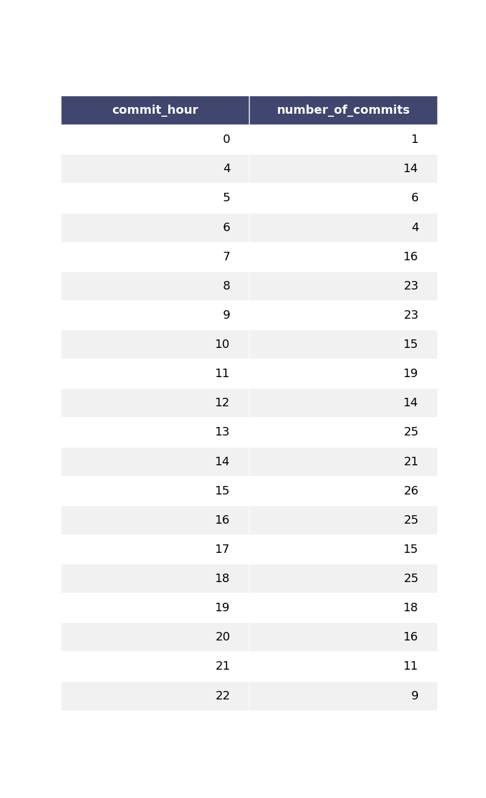

The visualization of table above:

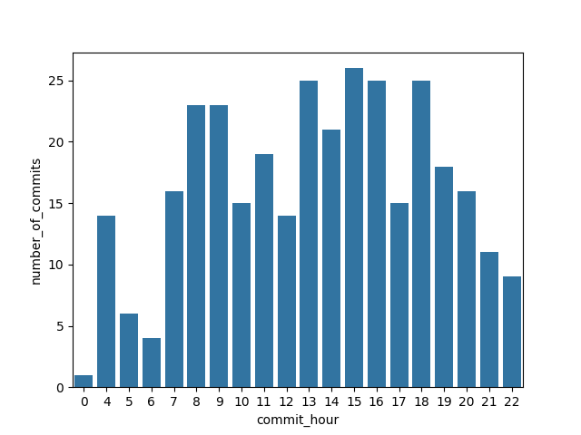

Below the distribution of number of commits per weekday is shown the form of boxplot:

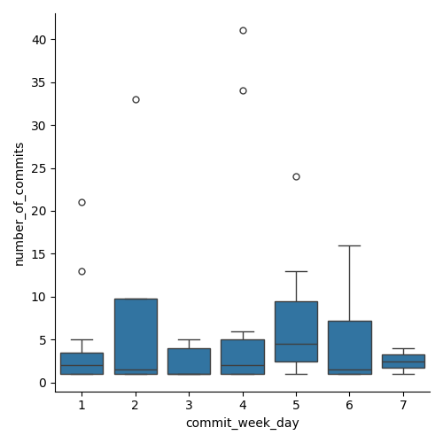

## 2. Contributors activity

Table below shows top 10 most active contributors in terms of number of commits:

Next table shows the most active contributors in terms of number of insertions:

Table showing top contributors in terms of insertions / deletions ratio:

Table showing top contributors in terms of number of commits per day of activity. This measure can be 
especially helpful for assessing the work of new developers, who joined the project quite recently:

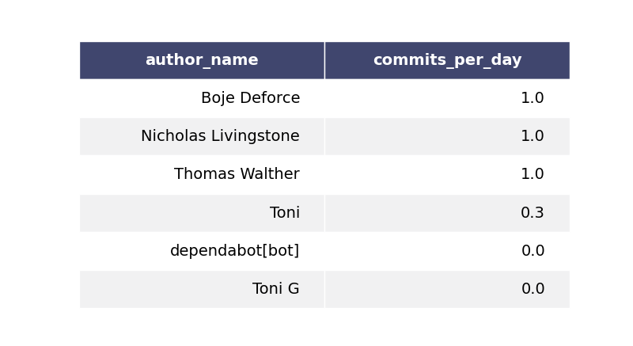

Similar table showing number of insertions per day:

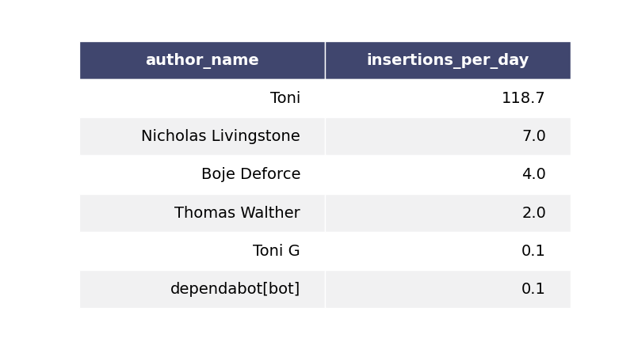

## 3. Messages patterns

In this sections we shows top words from commit messages both in raw version (without any transformation) and after process
of stemming (excluding plural suffix, etc.)

### 3.1 Raw words

Table showing top raw words in the commit messages:

Word cloud of raw words:

### 3.2 words after stemming

Table showing top stemmed words in the commit messages:
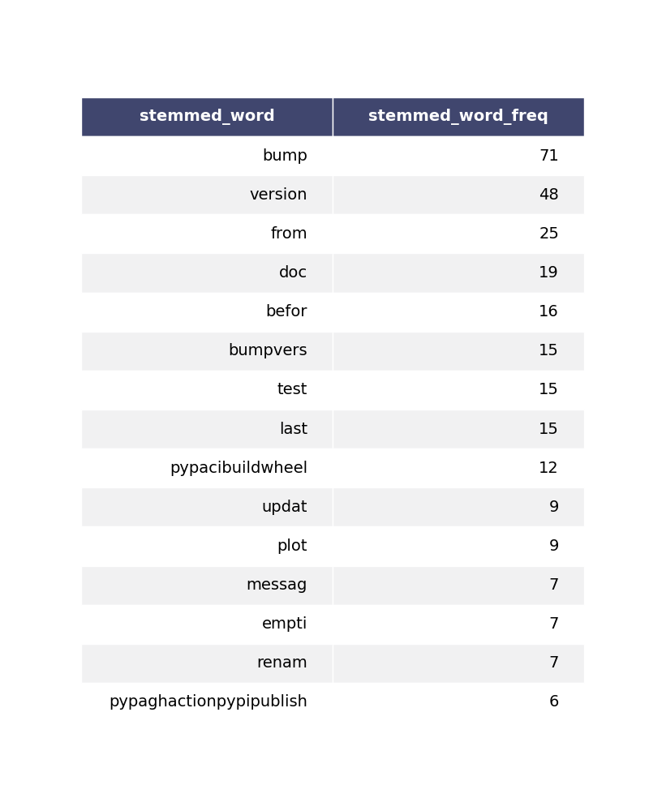

Word cloud of raw words:

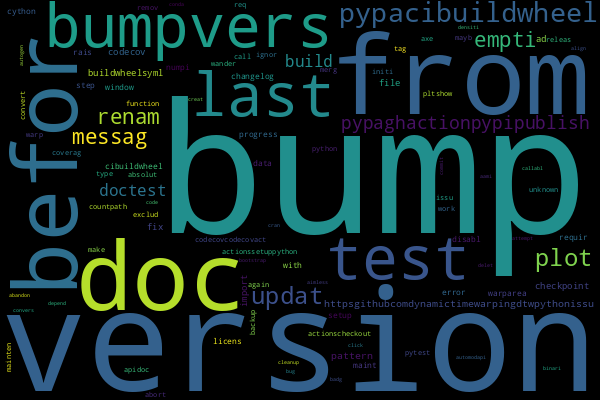

## 4. Periods of activity before merge

Table showing relation between number of commits and time to nearest merge:

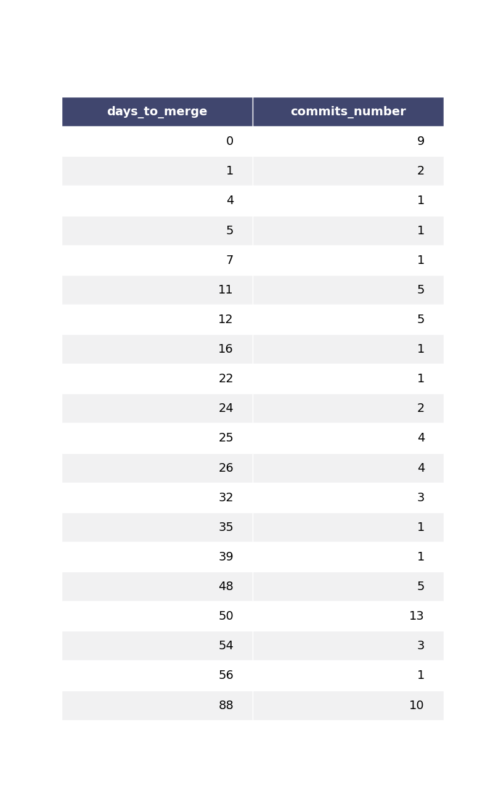

The same relation in the form of plot:

## 5. Insertions / deletions distributions

Table below shows the base statistical characteristics of insertions, such as
mean value, standard deviation, max, min, etc:

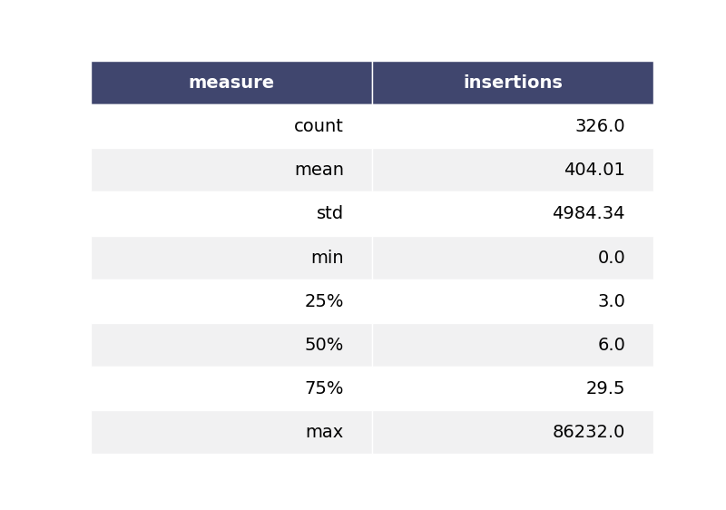

Plot below show the distributions of insertions per commit in the form of histogram. Average value is shown
as black line and median is represented by orange dashed line:

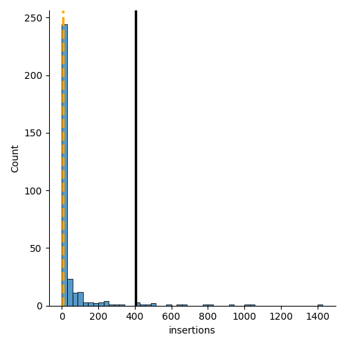

Table below shows the base statistical characteristics of insertions, such as
mean value, standard deviation, max, min, etc:

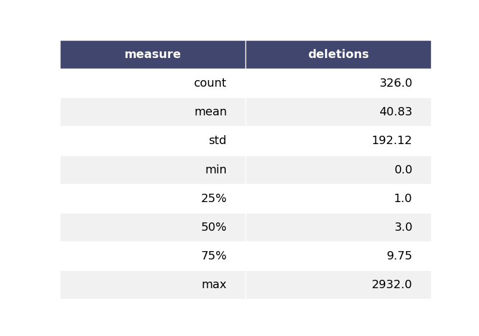

Histogram showing deletions distribuiton:

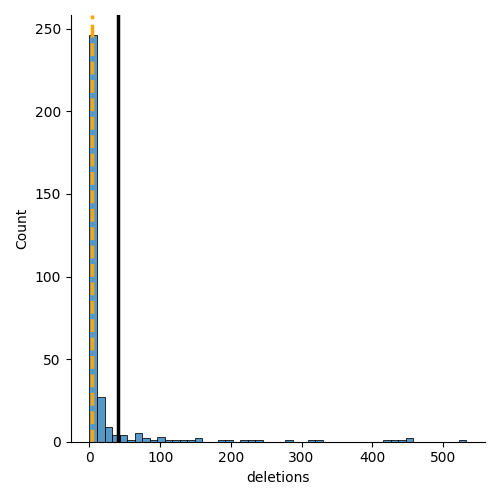

# Summary
Hope this document was helpful. For more information please take a look at the dashboard.